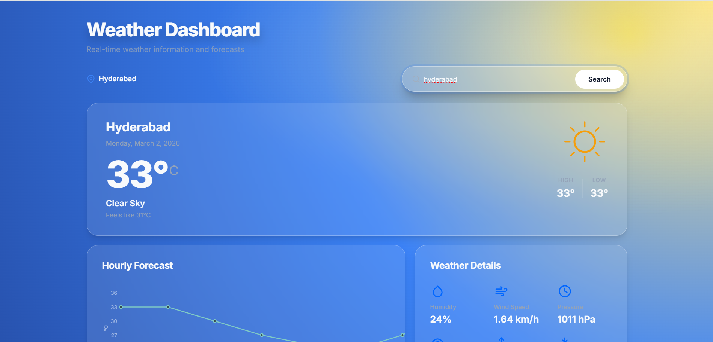
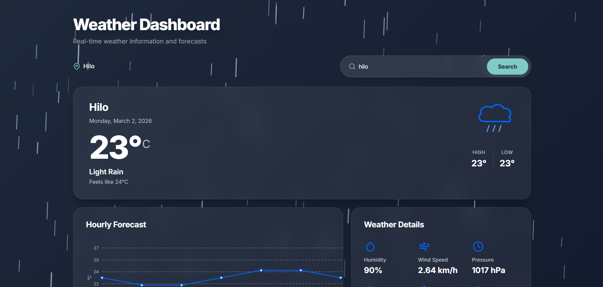
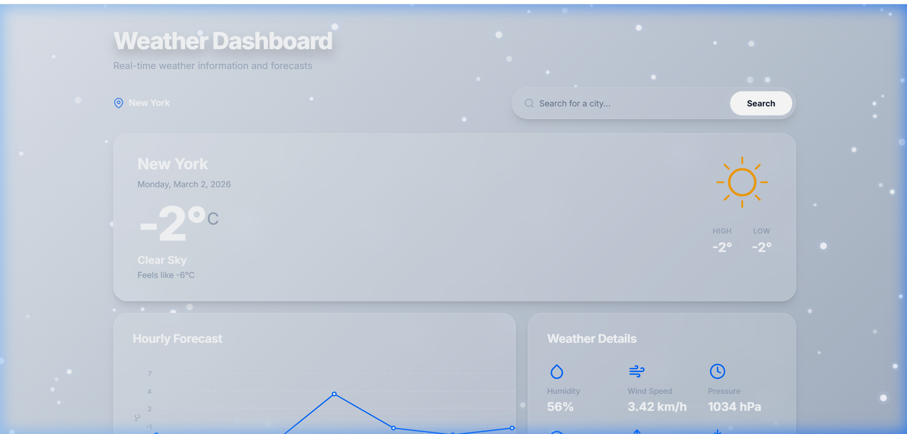
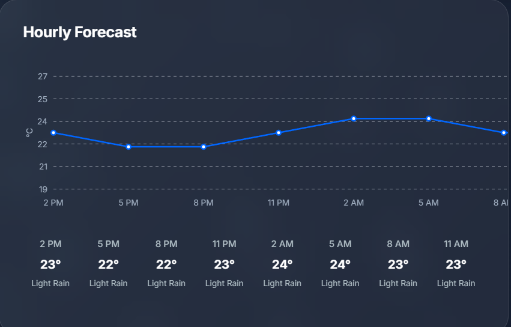

<div align="center">

# 🌦 Weather Dashboard  
### A Modern Animated Weather Experience

<p align="center">
  <b>Real-time weather • Immersive animations • Dynamic UI engine</b>
</p>

<br>

[](https://badigevamshi.github.io/weather_dashboard/)
[]
[]
[]

</div>

---

## ✨ Overview

**Weather Dashboard** is a fully responsive, premium weather application built using **Vanilla JavaScript, HTML5, and CSS3**.

Unlike basic weather apps, this project includes:

- 🌈 Dynamic weather-based themes  
- 🎥 Real-time animated weather effects  
- 📈 Custom-built temperature chart engine  
- 🧠 Smart 7-day forecast aggregation  
- 📱 Mobile-first responsive design  

---

# 🚀 Live Demo

🔗 **Visit Here:**  
👉 https://badigevamshi.github.io/weather_dashboard/

---

# 📸 Screenshots

## ☀ Clear Weather Theme


---

## 🌧 Rain Theme with Animation


---

## ❄ Snow Theme with Glow Effect


---

## 📊 Hourly Temperature Chart


---

# 🌟 Features

## 🌍 Core Features
- 🔎 City-based weather search
- 📍 Automatic geolocation detection
- 🌦 Real-time data from OpenWeatherMap API
- ⚠ Styled error handling system
- ⏳ Smooth loading animations

---

## 📊 Forecast System
- 🕒 Hourly forecast (next 8 intervals)
- 📅 Smart 7-day forecast aggregation
- 📈 Custom temperature chart using Canvas API
- 🌧 Precipitation probability display
- 📉 Dynamic daily temperature range bars

---

## 🎨 Dynamic Weather UI Engine

The entire interface automatically adapts based on weather conditions:

| Weather | UI Behavior |
|----------|-------------|
| ☀ Clear | Sun glow overlay animation |
| 🌧 Rain | Canvas rain animation |
| ❄ Snow | Snowfall particle engine |
| ⛈ Thunderstorm | Rain + Lightning flash |
| 🌫 Mist | Soft gradient theme |

Each weather condition dynamically updates:
- Background gradients
- Card glassmorphism styling
- Accent colors
- Text colors
- Chart theme

---

## 🌧 Advanced Animation Engine

- 🎥 Rain simulation using HTML5 Canvas
- ❄ Snowfall engine with glow effects
- ⚡ Random lightning flash system
- ☀ Pulsing sunny overlay
- 🧠 Automatic animation cleanup on weather change

---

## 📦 Weather Details Panel

Displays:

- 💧 Humidity
- 🌬 Wind Speed
- 🌡 Pressure
- 👁 Visibility
- 🌅 Sunrise (timezone-aware)
- 🌇 Sunset (timezone-aware)
- ☀ UV Index

---

## 📱 Responsive & Premium UI

- Mobile-first layout
- Adaptive grid system
- Smooth fade-in animations
- Glassmorphism card design
- Micro-interactions & hover effects

---

# 🛠 Tech Stack

- HTML5  
- CSS3 (Glassmorphism + Animations)  
- JavaScript (ES6+)  
- Canvas API  
- OpenWeatherMap API  

---

# 🧠 Architecture Highlights

- Modular rendering functions
- Centralized weather effects engine
- Timezone-aware formatting
- Dynamic theme class switching
- Retina-ready canvas rendering
- Memory-safe animation management

---

# 📂 Project Structure

```
weather_dashboard/
│
├── index.html
├── style.css
├── script.js
├── images/
│   ├── clear.png
│   ├── rain.png
│   ├── snow.png
│   └── hourly.png
└── README.md
```

---

# ⚙ Installation

Clone the repository:

```
git clone https://github.com/badigevamshi/weather_dashboard.git
```

Open:

```
index.html
```

---

# 🔑 API Setup

1. Create a free account at:
   https://openweathermap.org/

2. Replace the API key inside `script.js`:

```javascript
const apiKey = "YOUR_API_KEY_HERE";
```

---

# 🚀 Deployment

This project is deployed using **GitHub Pages**.

To deploy your own version:

1. Push project to GitHub
2. Go to **Settings → Pages**
3. Select:
   - Source: Deploy from branch
   - Branch: main
4. Save

---

# 🔮 Future Improvements

- 🌡 Temperature unit toggle (°C / °F)
- 🌙 Automatic day/night mode
- 📍 Search history persistence
- 📡 Air Quality Index integration
- 📲 Progressive Web App (PWA)
- 🗺 Interactive weather map

---

# 👨‍💻 Author

**Vamshi**

GitHub:  
https://github.com/badigevamshi

---

<div align="center">

⭐ If you like this project, consider giving it a star!

</div>